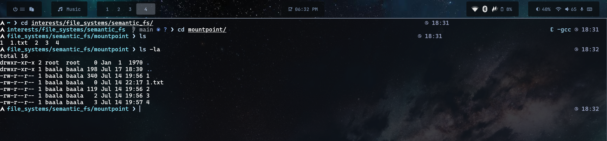
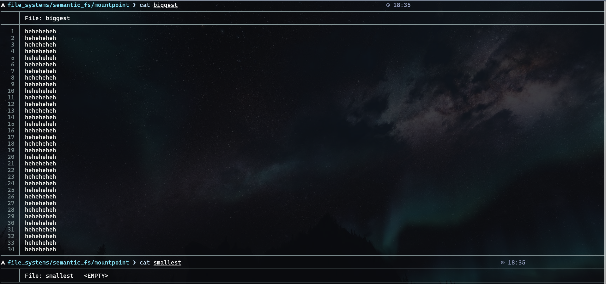
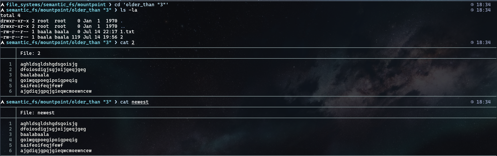
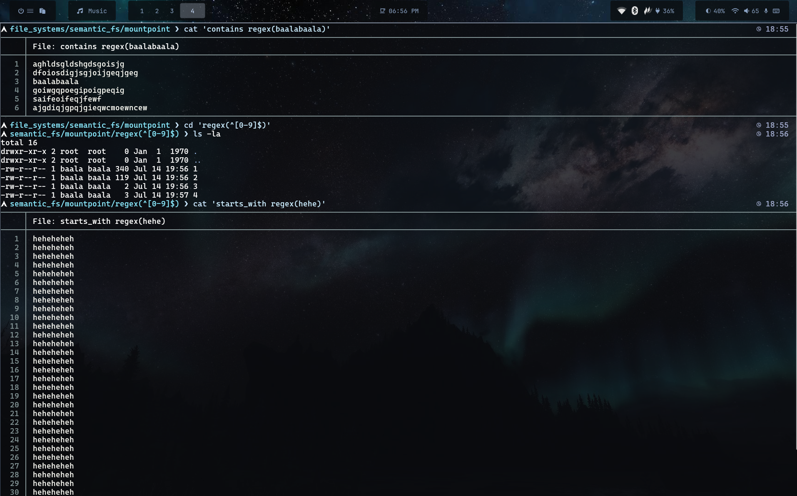

# QueryFS

# INFO
I randomly came across fuse and developed this urge to write a custom filesystem. So here I am, QueryFS is a query based filesystem as the name suggests. 
Using a pretty minimal grammar (checkout [THE AST](./Parser/ast.h) and [THE GRAMMAR](./Parser/grammar.md)) it is able to group the files that satisfy the user's query and present it as a directory [...]

# DEMO
The folder tests is used in the following images for testing the filesystem






# REQUIREMENTS

## System Dependencies

- **GCC Compiler** - The project is compiled using GCC
- **FUSE 3 Library** - Required for the filesystem implementation (libfuse3 development headers)
- **pkg-config** - Used to locate and configure FUSE3
- **Make** - Build automation tool

## Installation

### Ubuntu/Debian

```bash
sudo apt-get update
sudo apt-get install libfuse3-dev build-essential pkg-config
```

### Fedora/RHEL

```bash
sudo dnf install fuse3-devel gcc make pkg-config
```

### Arch Linux

```bash
sudo pacman -S fuse3 gcc make pkg-config
```

### macOS

```bash
brew install osxfuse gcc make pkg-config
```

# BUILDING

Once all requirements are installed, build the project using:

```bash
make all
```

This will compile the filesystem binary and run all unit tests.

### Build targets:
- `make all` - Build the main filesystem binary and run tests
- `make test` - Run unit tests only (scanner, parser, interpreter tests)
- `make baalafs` - Build only the main filesystem binary
- `make clean` - Remove compiled binaries

The compiled filesystem binary will be created at `./binaries/baalafs`

# RUNNING

### Mount the filesystem

```bash
./binaries/baalafs <source_directory> <mount_point>
```

Example:
```bash
./binaries/baalafs ~/my_files ~/my_files_mount
```

### Query the filesystem

Once mounted, navigate to the mount point and query files using the minimal grammar:

```bash
cd ~/my_files_mount
ls                    # List all files
cd 'query_expression' # Navigate to files matching the query (ex : cd 'newer_than "a.txt")
cat 'query_expression_that_evaluates_to_a_single_file' (ex : cat 'newest')

```

### Unmount the filesystem

```bash
fusermount -u <mount_point>
```

Example:
```bash
fusermount -u ~/my_files_mount
```

# USAGE

## Query Structure

The query language is built on logical operators and file matching criteria. All queries follow this hierarchy:

```
query
  └─ or_group (connected with "or")
      └─ and_group (connected with "and")
          └─ unary (optionally negated with "not")
              └─ group (name or characteristic)
```

## Core Operators

### Logical Operators

- **`and`** - Combine conditions (both must match)
  ```
  query1 and query2
  ```

- **`or`** - Combine conditions (either can match)
  ```
  query1 or query2
  ```

- **`not`** - Negate a condition
  ```
  not query1
  ```

## Name-Based Queries

### Path Matching

Match files by path (comma-separated list):

```
"path|to|file"
"path|to|file1", "path|to|file2"
```

**Note:** Use `|` instead of `/` for path separators; quotes are required.

### Regex on Filenames

Match files by filename pattern:

```
regex(pattern)
```

Examples:
```
regex(\.txt$)          # All .txt files
regex(^test_)          # Files starting with "test_"
regex([0-9]+)          # Files containing numbers
```

## Time-Based Queries

### Newer Than

Find files modified more recently than a reference:

```
newer than group
```

Examples:
```
newer than "reference|file"
newer than regex(\.log$)
```

### Older Than

Find files modified earlier than a reference:

```
older than group
```

Examples:
```
older than "reference|file"
older than regex(\.bak$)
```

### Newest Files

Get the newest N file(s):

```
newest              # Single newest file
newest 5            # 5 newest files
```

### Oldest Files

Get the oldest N file(s):

```
oldest              # Single oldest file
oldest 10           # 10 oldest files
```

## Size-Based Queries

### Bigger Than

Find files larger than a reference or byte count:

```
bigger than group           # Larger than a reference file
bigger than NUMBER          # Larger than N bytes
```

Examples:
```
bigger than "reference|file"
bigger than 1024            # Larger than 1KB
bigger than 1048576         # Larger than 1MB
```

### Smaller Than

Find files smaller than a reference or byte count:

```
smaller than group          # Smaller than a reference file
smaller than NUMBER         # Smaller than N bytes
```

Examples:
```
smaller than "reference|file"
smaller than 512            # Smaller than 512 bytes
smaller than 10485760       # Smaller than 10MB
```

### Biggest Files

Get the largest N file(s):

```
biggest             # Single largest file
biggest 3           # 3 largest files
```

### Smallest Files

Get the smallest N file(s):

```
smallest            # Single smallest file
smallest 5          # 5 smallest files
```

## Content-Based Queries

### Starts With

Match files whose content matches a regex pattern from the beginning:

```
starts_with regex(pattern)
```

Examples:
```
starts_with regex(#!/bin/bash)      # Shell scripts
starts_with regex(<?php)             # PHP files
```

### Contains

Match files whose content contains a regex pattern:

```
contains regex(pattern)
```

Examples:
```
contains regex(TODO)
contains regex(import\s+\w+)        # Import statements
contains regex(function\s+\w+\()     # Function definitions
```

## Combined Query Examples

### Simple Combinations

```
"file1" and "file2"                          # Both specific files
newer than "reference" or older than "old"   # Either newer or older
not regex(\.tmp$)                            # Exclude temp files
```

### Complex Queries

```
(smaller than 1024) and (contains regex(error))
# Files smaller than 1KB that contain "error"

newer than "lastmodified" and regex(\.log$)
# Recent .log files

(biggest 5) or (smallest 5)
# Either the 5 largest or 5 smallest files

not (contains regex(backup)) and newer than "reference|file"
# Recent files that don't contain "backup" in their content
```

### Real-World Examples

```
# Find all Python files
regex(\.py$)

# Find large log files modified recently
bigger than 1048576 and regex(\.log$) and newer than "lastcheck"

# Find either very new or very old files
(newest 10) or (oldest 10)

# Find small text files that contain "config"
smaller than 8192 and regex(\.txt$) and contains regex(config)

# Exclude backups and find medium-sized files
not regex(\.bak$) and bigger than 512 and smaller than 1048576
```

## Regex Pattern Syntax

The regex patterns use standard regex notation:

- `\.` - Literal dot
- `$` - End of string
- `^` - Start of string
- `[abc]` - Character class
- `[0-9]` - Digit class
- `\s` - Whitespace
- `\w` - Word character
- `+` - One or more
- `*` - Zero or more
- `()` - Grouping
- `|` - Alternation

## Path Syntax Rules

- Paths must be surrounded by **double quotes**
- Use `|` instead of `/` as path separators
- Example: `"home|user|documents|file.txt"` represents `home/user/documents/file.txt`

## Important Limitations & Notes

- Empty regex patterns are allowed: `regex()` matches any file
- Numeric values represent **bytes** for size comparisons
- Paths should exist for reference-based comparisons (newer/older/bigger/smaller than)
- The filesystem evaluates queries recursively through all matching conditions
- Paths should always be surrounded by double quotes
- Paths should be typed with `|` in place of `/`. The scanner will later substitute `/` in place of `|`
- Regex patterns should be surrounded in `regex()`
